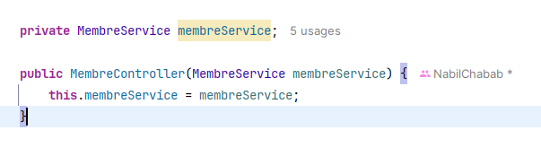

## SPRING FRAMEWORK

This application is a basic User Management System
built using Spring Core without Spring Boot,
Spring MVC, and Spring Data JPA. It allows users to perform CRUD operations
such as creating, viewing, updating, and deleting users through a web interface.

## Table of Contents
- [Project Structure](#project-structure)
- [Dependency Injection (DI)](#dependency-injection-di)
- [Inversion of Control (IoC)](#inversion-of-control-ioc)
- [Spring Beans](#spring-beans)
- [Bean Scopes](#bean-scopes)
- [ApplicationContext](#applicationcontext)
- [Component Scanning and Stereotype Annotations](#component-scanning-and-stereotype-annotations)
- [Spring Data JPA](#spring-data-jpa)
- [Spring MVC](#spring-mvc)
- [Installation and Setup](#installation-and-setup)

### Project Structure

-> model : Contains the Membre entity class using Lombok annotations

-> repository : Contains the MembreRepository interface that extends the JpaRepository interface for managing the CRUD Operations

-> services : Contains the MembreService interface and its implementation class MembreServiceImpl for managing the business logic

-> controller : Contains the MembreController class for handling the HTTP requests for spring MVC

-> resources : Contains the applicationContext.xml file for configuring the Spring Beans and for configuring the database connection also the entityManagerFactory and transactionManager beans for JPA

-> webapp : Contains the JSP files for the user interface and the web.xml file for configuring the DispatcherServlet and the ContextListener applicationContext.xml

### Dependency Injection (DI)

DI is a technique in which an object receives other objects that it depends on. These other objects are called dependencies. In Spring, DI is implemented using the `@Autowired` annotation. but theres other ways to implement DI in Spring such as:
- Constructor Injection for an exemple like what i did in the MembreController i use the MembreService class : 

- Setter Injection
- Field Injection

### Inversion of Control (IoC)

IoC is a principe in which the control of objects is transferred to a container or framework. In Spring, IoC is implemented using the ApplicationContext interface

### Spring Beans

Spring Beans are Java objects that are managed by the Spring IoC container Beans are created configured and managed by the Spring IoC container. Beans are defined in the Spring configuration file (applicationContext.xml) using the <bean> element

### Bean Scopes

The scope of a bean defines the lifecycle and visibility of a bean. Spring supports the following bean scopes:
- Singleton: A single instance of the bean is created for each Spring IoC container
- Prototype: A new instance of the bean is created each time the bean is requested

### ApplicationContext

The ApplicationContext interface is the central interface in a Spring application for providing configuration information to the application

### Component Scanning and Stereotype Annotations

Component scanning is a feature in Spring that allows Spring to automatically discover and register beans in the Spring IoC container. Stereotype annotations are used to indicate the role of a class in the application

### Spring Data JPA

Spring Data JPA is a part of the Spring Data project that makes it easier to work with JPA in Spring applications Spring Data JPA provides repository support for JPA allowing you to create repositories that interact with the database without writing any code

### Spring MVC

Spring MVC is a part of the Spring Framework that provides a model-view-controller architecture for building web applications

### Installation and Setup