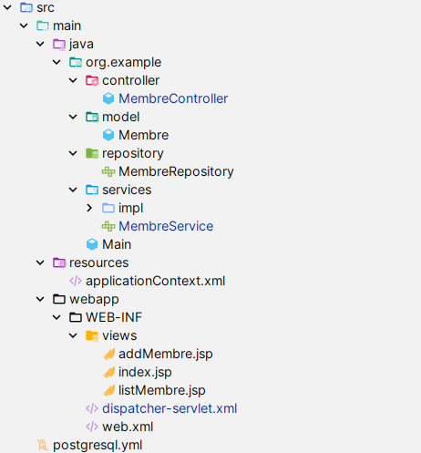

## SPRING FRAMEWORK

This application is a basic User Management System
built using Spring Core without Spring Boot,
Spring MVC, and Spring Data JPA. It allows users to perform CRUD operations
such as creating, viewing, updating, and deleting users through a web interface.

## Table of Contents
- [Project Structure](#project-structure)
- [Dependency Injection (DI)](#dependency-injection-di)
- [Inversion of Control (IoC)](#inversion-of-control-ioc)
- [Spring Beans](#spring-beans)
- [Bean Scopes](#bean-scopes)
- [ApplicationContext](#applicationcontext)
- [Component Scanning and Stereotype Annotations](#component-scanning-and-stereotype-annotations)
- [Spring Data JPA](#spring-data-jpa)
- [Spring MVC](#spring-mvc)
- [Installation and Setup](#installation-and-setup)

### Project Structure

-> model : Contient la classe d'entité Membre utilisant les annotations de Lombok

-> repository : Contient l'interface MembreRepository qui étend l'interface JpaRepository pour gérer les opérations CRUD

-> services : Contient l'interface MembreService et sa classe d'implémentation MembreServiceImpl pour gérer la logique métier

-> controller : Contient la classe MembreController pour gérer les requêtes HTTP dans Spring MVC

-> resources : Contient le fichier applicationContext.xml pour configurer les Beans de Spring et la connexion à la base de données, ainsi que les beans entityManagerFactory et transactionManager pour JPA

-> webapp : Contient les fichiers JSP pour l'interface utilisateur et le fichier web.xml pour configurer le DispatcherServlet et le ContextListener

### Dependency Injection (DI)

est une technique où un objet reçoit d'autres objets dont il dépend. Ces autres objets sont appelés dépendances. Dans Spring, la DI est implémentée avec l'annotation @Autowired, mais il existe d'autres manières d'implémenter la DI dans Spring, comme :
- L'injection par constructeur, par exemple dans le MembreController, où j'utilise la classe MembreService. 

- Setter Injection
- Field Injection

### Inversion of Control (IoC)

L'IoC (inversion de contrôle) est un principe dans lequel le contrôle des objets est transféré à un conteneur ou un framework. Dans Spring, l'IoC est implémenté en utilisant l'interface ApplicationContext.
### Spring Beans

Les Beans Spring sont des objets Java gérés par le conteneur IoC de Spring. Les beans sont créés, configurés et gérés par le conteneur IoC de Spring. Les beans sont définis dans le fichier de configuration Spring (applicationContext.xml) à l'aide de l'élément <bean>.

### Bean Scopes

scope d'un bean définit le cycle de vie et la visibilité d'un bean. Spring prend en charge les portées de beans suivantes :
- Singleton: Une seule instance du bean est créée pour chaque conteneur IoC de Spring.
- Prototype: Une nouvelle instance du bean est créée à chaque fois que le bean est demandé.

### ApplicationContext

L'interface ApplicationContext est l'interface centrale dans une application Spring pour fournir les informations de configuration à l'application.

### Component Scanning and Stereotype Annotations

Component scanning est une fonctionnalité de Spring qui permet à Spring de découvrir et d'enregistrer automatiquement les beans dans le conteneur IoC de Spring. Les annotations de stéréotype sont utilisées pour indiquer le rôle d'une classe dans l'application.

### Spring Data JPA

Spring Data JPA fait partie du projet Spring Data, ce qui rend plus facile l'utilisation de JPA dans les applications Spring. Spring Data JPA fournit un support pour les dépôts JPA, permettant de créer des dépôts qui interagissent avec la base de données sans écrire de code.

### Spring MVC

Spring MVC est une partie du framework Spring qui fournit une architecture modèle-vue-contrôleur pour construire des applications web.

### Installation and Setup